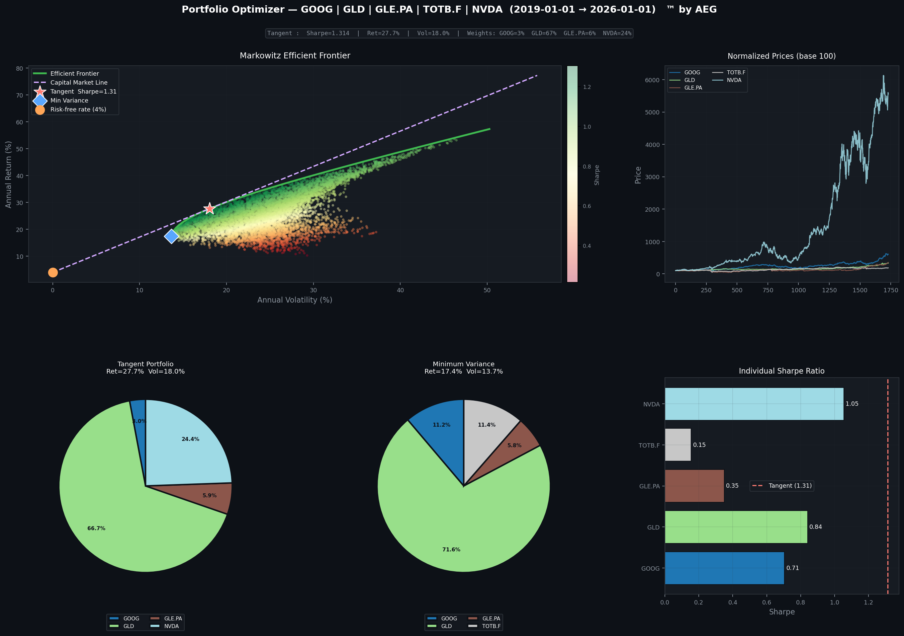

# Portfolio Optimizer ™ by AEG

A complete portfolio optimization tool in Python based on the **Markowitz Modern Portfolio Theory**.  
Select financial assets, retrieve historical data, simulate thousands of portfolios and find the optimal allocation.



---

## Features

- Interactive GUI to search and select assets (equities, ETFs, indices, crypto, currencies)
- Historical data download via Yahoo Finance
- Monte Carlo simulation of 8 000 random portfolios
- Efficient Frontier computation
- Tangent Portfolio (max Sharpe) and Minimum Variance Portfolio
- Full graphical dashboard exported as PNG

---

## Installation

```bash
git clone https://github.com/your-username/portfolio-optimizer.git
cd portfolio-optimizer
pip install -r requirements.txt
```

---

## Usage

```bash
python3 portfolio_optimizer.py
```

1. Search and add at least 2 assets in the GUI
2. Set the analysis period and risk-free rate
3. Click **RUN ANALYSIS**
4. The dashboard is saved as `portfolio_result.png`

---

## Project Structure

```
portfolio-optimizer/
├── portfolio_optimizer.py   # Main script
├── requirements.txt
├── README.md
├── .gitignore
├── LICENSE
└── docs/
    ├── fiche_projet.pdf     # Project report
    └── fiche_projet.tex
```

---

## Dependencies

| Library | Purpose |
|---|---|
| `numpy` | Matrix algebra |
| `pandas` | Time series handling |
| `scipy` | SLSQP optimization |
| `matplotlib` | Dashboard visualization |
| `yfinance` | Market data download |
| `financedatabase` | Asset catalog |
| `tkinter` | Graphical interface |

---

## Theory

The optimizer is based on the **Markowitz (1952)** framework:

- **Portfolio return:** $R_p = w^T \mu$
- **Portfolio volatility:** $\sigma_p = \sqrt{w^T \Sigma w}$
- **Sharpe ratio:** $S = \frac{R_p - R_f}{\sigma_p}$

The efficient frontier is traced by solving:

$$\min_w \ w^T \Sigma w \quad \text{s.t.} \quad w^T \mu = R_{\text{target}}, \quad \sum w_i = 1$$

See [`docs/fiche_projet.pdf`](docs/Portfolio_Optimization_Markowitz.pdf) for the full mathematical write-up.

---

## License

MIT — © 2026 Adam El Gbouri
