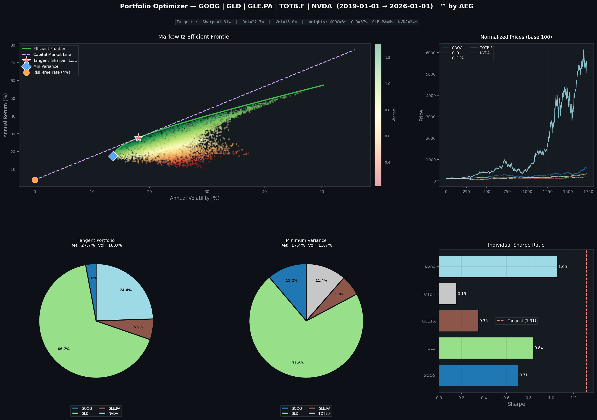

# Portfolio Optimizer ™ by AEG

A complete portfolio optimization web app based on the **Markowitz Modern Portfolio Theory**.  
Search and select assets from a database of 47 000+ instruments, simulate thousands of portfolios, and find the optimal allocation — all in an interactive dashboard.

---

## Live App

**[aeg-markowitz.streamlit.app](https://aeg-markowitz.streamlit.app)**

---

---

## Features

- Search & select assets from 47 000+ instruments (equities, ETFs, indices, crypto, currencies) via `financedatabase`
- Historical data download via Yahoo Finance
- Monte Carlo simulation of 8 000 random portfolios
- Efficient Frontier & Capital Market Line
- Tangent Portfolio (Max Sharpe) and Minimum Variance Portfolio
- **Budget allocation** — distributes your investment across assets with optimal weights
- **Live prices** — real-time market prices with EUR/USD conversion, number of shares, and performance vs backtest end date
- Interactive Plotly charts (zoom, hover, export)
- Correlation heatmap, rolling Sharpe ratio, drawdown analysis
- Portfolio comparison (Tangent vs Min Variance) with CAGR & Max Drawdown
- Full CSV export of results and weights

---

## Dashboard Tabs

| Tab | Content |
|-----|---------|
| 📊 Frontier | Efficient frontier, CML, Monte Carlo cloud, individual assets |
| 📈 Prix & Drawdown | Normalized prices & drawdown per asset |
| 🥧 Allocations | Pie charts + cumulative performance |
| 🔬 Risque | Individual Sharpe bars, correlation matrix, rolling Sharpe |
| 💰 Budget & Live | Budget allocation table, live prices, Δ vs backtest |
| 📋 Résumé | Portfolio comparison, statistics, CSV export |

---

## Theory

The optimizer is based on the **Markowitz (1952)** framework:

- **Portfolio return:** $R_p = w^T \mu$
- **Portfolio volatility:** $\sigma_p = \sqrt{w^T \Sigma w}$
- **Sharpe ratio:** $S = \frac{R_p - R_f}{\sigma_p}$

The efficient frontier is traced by solving:

$$\min_w \ w^T \Sigma w \quad \text{s.t.} \quad w^T \mu = R_{\text{target}}, \quad \sum w_i = 1$$

The Tangent Portfolio is found via multi-start SLSQP optimization (50 random initializations) maximizing the Sharpe ratio.

See [`docs/Portfolio_Optimization_Markowitz.pdf`](docs/Portfolio_Optimization_Markowitz.pdf) for the full mathematical write-up.

---

## Dependencies

| Library | Purpose |
|---------|---------|
| `streamlit` | Web app framework |
| `plotly` | Interactive charts |
| `numpy` | Matrix algebra |
| `pandas` | Time series handling |
| `scipy` | SLSQP optimization |
| `yfinance` | Market data & live prices |
| `financedatabase` | 47 000+ asset catalog |

---

## License

MIT — © 2026 Adam El Gbouri

---

*Built with Python · Streamlit · Yahoo Finance · Plotly*

